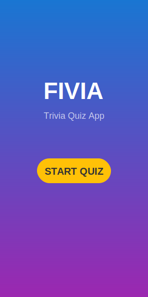
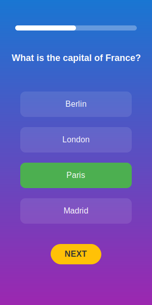
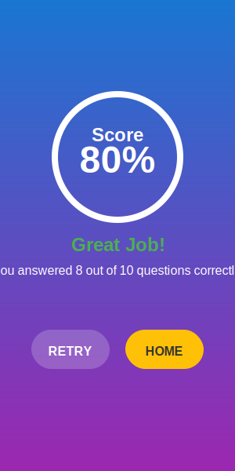

# Fivia - Interactive Trivia Quiz App

<p align="center">
  
</p>

Fivia is a beautifully designed trivia quiz application built with Flutter. Test your knowledge across various topics with an engaging and interactive quiz experience.

## ✨ Features

- **Engaging Quiz Experience**: Answer trivia questions across various knowledge domains
- **Beautiful UI**: Modern, gradient-based design with smooth animations
- **Score Tracking**: Real-time score calculation and performance feedback
- **Progress Indicator**: Visual representation of quiz completion progress
- **Result Analysis**: Detailed results with performance-based feedback
- **Optimized for Android**: Compatible with Android 5.0+ devices

## 📱 Screenshots

<p align="center">
  
  
  
</p>

## 📋 Requirements

- Android 5.0 (Lollipop) or higher
- 50MB of free storage
- Internet connection not required (all questions are stored locally)

## 📥 Installation

### Option 1: Direct APK Download

1. Go to the [Releases](https://github.com/frivia-app/frivia/releases) page
2. Download the latest `app-release.apk` file
3. On your Android device, enable "Install from Unknown Sources" in settings
4. Open the downloaded APK file to install

### Option 2: Build from Source

1. Clone this repository
   ```
   git clone https://github.com/frivia-app/frivia.git
   ```

2. Navigate to the project directory
   ```
   cd fivia
   ```

3. Install dependencies
   ```
   flutter pub get
   ```

4. Build the APK
   ```
   flutter build apk --release
   ```

5. The APK will be available at `build/app/outputs/flutter-apk/app-release.apk`

## 🚀 Usage

1. Launch the Fivia app
2. Tap the "Start Quiz" button on the home screen
3. Read each question carefully and select your answer
4. See immediate feedback on your answer (correct/incorrect)
5. Continue through all questions to complete the quiz
6. View your final score and performance assessment
7. Restart the quiz to improve your score

## 🔧 Technical Details

- Built with Flutter framework
- Material Design 3 components
- Animations using Flutter's animation controllers
- Local data storage for quiz questions
- Optimized for various screen sizes

## 🔒 Android Compatibility

Fivia has been optimized for wide Android device compatibility:

- Supports Android 5.0 (API level 21) and above
- Implements MultiDex for older devices
- Properly signed with release keys
- Optimized with ProGuard for security and performance

For detailed Android compatibility information, see [ANDROID_COMPATIBILITY.md](ANDROID_COMPATIBILITY.md).

## 🤝 Contributing

Contributions are welcome! Please read [CONTRIBUTING.md](CONTRIBUTING.md) for details on our code of conduct and the process for submitting pull requests.

## 📄 License

This project is licensed under the MIT License - see the [LICENSE](LICENSE) file for details.

## 📦 GitHub Release Process

This project uses GitHub Actions to automatically build and release the APK when a new tag is pushed. For detailed instructions on creating a release, see [RELEASE_GUIDE.md](RELEASE_GUIDE.md).

## 📞 Contact

If you have any questions or feedback, please open an issue on this repository.

---

Enjoy using Fivia! 🎮 Happy quizzing!
